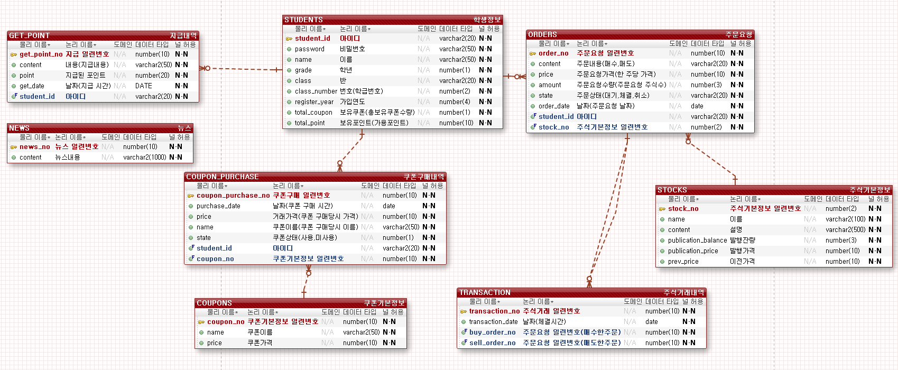
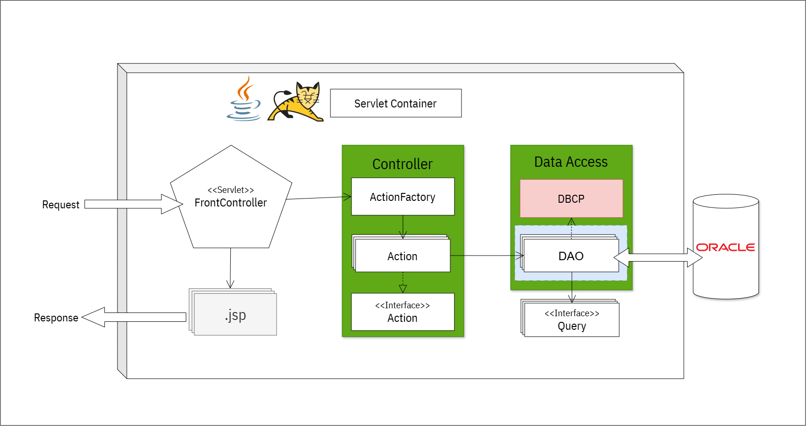
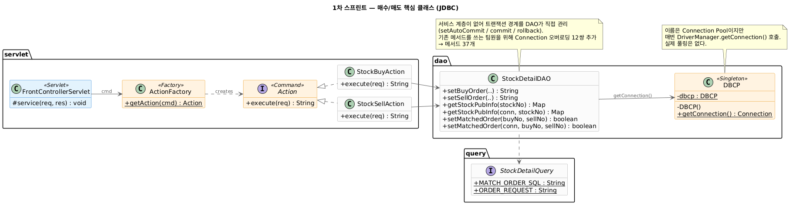
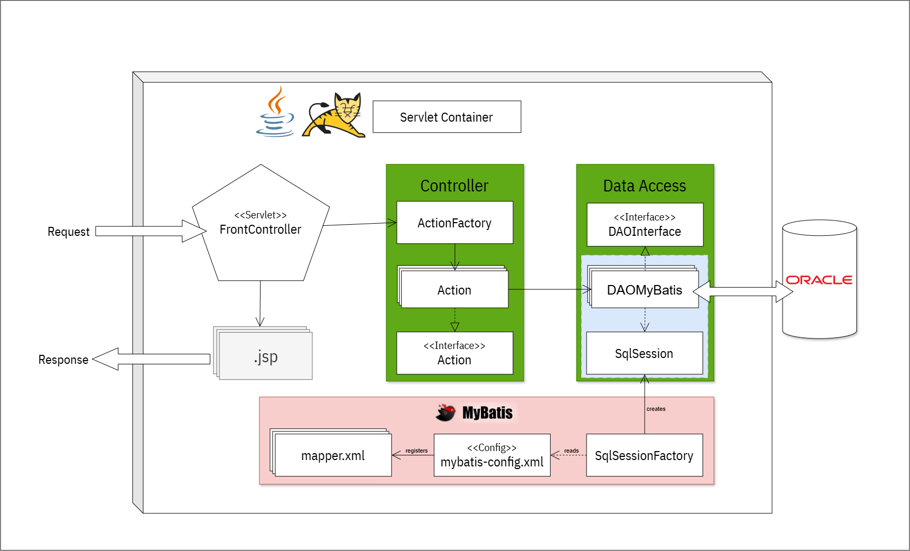
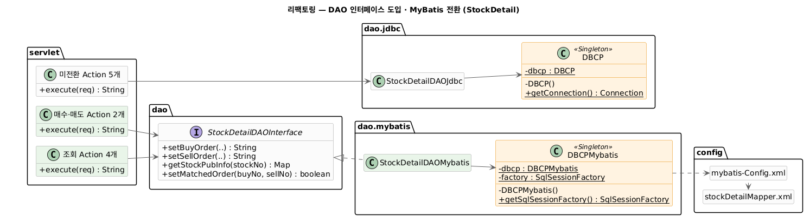

# SchoolStock — 학교 모의 주식투자 플랫폼

학생이 선생님에게 받은 포인트로 모의 주식을 사고팔며 투자를 배우는 웹 서비스.
**Servlet/JSP 기반 Model 2 MVC**에 Command · Factory · Singleton 패턴을 적용해 도메인과 핵심 기능을 구축한 1차 스프린트 프로젝트입니다.


<table>
<tr valign="top">
<td width="50%">

| 브랜치 | 내용 |
|---|---|
| [`sprint1-jdbc`](../../tree/sprint1-jdbc) | 1차 스프린트 완성본 · 순수 JDBC |
| [`main`](../../tree/main) | 리팩토링 완료본 · MyBatis 전환 |

</td>
<td width="50%">

| 구분 | 원본 저장소 |
|---|---|
| 저장소 | [Inhwa1003/1st_SchoolStock](https://github.com/Inhwa1003/1st_SchoolStock) |
| 내 PR | [17건](https://github.com/Inhwa1003/1st_SchoolStock/pulls?q=is%3Apr+author%3Agitdong95) |
| 내 커밋 | [필터](https://github.com/Inhwa1003/1st_SchoolStock/commits/default?author=gitdong95) |

</td>
</tr>
</table>

---

## 📌 1. 프로젝트 개요

| 항목 | 내용 |
|---|---|
| 1차 스프린트 | 2026-04-13 ~ 05-04 · 4명 |
| 리팩토링 | 2026-05-04 ~ 05-24 · 3명 |
| 개발 형태 | 팀 프로젝트 · 애자일(스프린트) 기반 · 이슈 번호 브랜치 → PR → 리뷰 → 머지 |
| 진행 방식 | Servlet/JSP 기반 Model 2 MVC로 도메인·핵심 기능 구현 · Command / Factory / Singleton 패턴 적용 |
| 내 담당 | 주식 상세 — 매수·매도 체결 |
| 핵심 목표 | MVC 계층 분리 · 트랜잭션 경계 설계 · DAO 인터페이스 도입 · JDBC → MyBatis 이관 |

---

## 🧩 2. 주요 기능

| 도메인 | 기능 |
|---|---|
| **주식 상세 (담당)** | **매수·매도 주문, 체결/대기/취소, 호가 조회, 내 주문 관리** |
| 주식 목록 | 시세 조회, 등락률, 폴링 갱신 |
| 회원 | 회원가입, 로그인, 중복 확인 |
| 내 자산 | 보유 주식·포인트 조회 |
| 쿠폰 | 쿠폰 상점, 구매, 사용 |
| 포인트 내역 | 지급 내역 조회 |
| 뉴스 | 종목 뉴스 조회 |

---

## 🛠 3. 기술 스택

**공통**

| 구분 | 기술 |
|---|---|
| Language | Java 8 (`jdk1.8.0_71`) |
| Backend | Servlet 3.0 · JSP · JSTL 1.2 |
| Frontend | JSP · CSS · JavaScript · Bootstrap 4.6 |
| Database | Oracle XE |
| Library | Gson 2.8.9 — Ajax 응답 JSON 직렬화 |
| Test | JUnit 4 |
| Server | Apache Tomcat 8.0 |

**시점별 변경**

| 구분 | 1차 | 리팩토링 |
|---|---|---|
| DB 접근 | JDBC (`ojdbc5`) | MyBatis 3.2.3 |
| SQL 위치 | Java 상수 23개 | Mapper XML 7개 |
| DAO 구조 | 구현 클래스를 직접 사용 | 인터페이스 7개 + 구현 분리 |

---

## 🗄 4. ERD



**테이블 8개**

| 테이블 | 역할 |
|---|---|
| `students` | 학생 · 보유 포인트 · 보유 쿠폰 수 |
| `stocks` | 종목 · 발행가 · 발행잔량 · 이전가격 |
| `orders` | 주문 요청 (매수/매도 · 대기/체결/취소) |
| `transaction` | 체결 내역 (매수주문번호 ↔ 매도주문번호) |
| `coupons` · `coupon_purchase` | 쿠폰 · 구매 내역 |
| `news` | 종목 뉴스 |
| `get_point` | 포인트 지급 내역 |

---

## ✨ 5. 주요 구현 포인트

**1차 스프린트**

- **Front Controller + Command** — 진입점은 서블릿 하나. 요청 하나가 클래스 하나(`Action` 23개)에 대응하고, 분기는 `ActionFactory`의 `case` 23건에 모임
- **3단계 체결 분기** — 발행잔량 매수 → 학생 간 매칭 → 대기 등록
- **DAO가 트랜잭션 경계를 직접 관리** — 쓰기 4개를 `setAutoCommit(false)` ~ `commit`으로 묶음
- **`FOR UPDATE`로 이중 체결 차단** — 매칭 대상 매도 주문 행을 잠가 동시 매수를 직렬화
- **Ajax 비동기 갱신** — `XMLHttpRequest` · `fetch` 로 시세·주문 현황을 부분 갱신, 응답은 Gson JSON

**리팩토링**

- **DAO 인터페이스 도입** — 계약을 고정하고 구현을 갈아끼울 자리를 만듦
- **MyBatis 이관** — 자원 관리를 `SqlSession`에 넘겨 메서드 37 → 24, `Connection` 오버로딩 12쌍 소멸
- **SQL을 Mapper XML로 분리** — Java 상수 23개 → XML 7개

---

## 🏗 6. 1차 스프린트

### 6-1. 아키텍처



| 계층 | 구성 요소 | 패턴 | 역할 |
|---|---|---|---|
| **Controller** | `FrontControllerServlet` · `ActionFactory` | **Factory** | 모든 요청의 단일 진입점, `cmd` 기반 Action 분기 |
| **Command** | `Action` 인터페이스 + 구현체 **23개** | **Command** | 요청 하나 = 클래스 하나, `execute(req)` 단일 메서드 |
| **Persistence** | DAO **7개** · `DBCP` | **Singleton** | 조회·저장 + 트랜잭션 경계까지 담당 (Service 계층 없음) |
| **Model** | VO **8개** · `query` SQL 상수 **7개** | — | 테이블 매핑 객체 · SQL 분리 |
| **View** | JSP **13개** · Gson | — | 서버 렌더링 · Ajax 응답 JSON 직렬화 |

### 6-2. 클래스 구조



*주황 = 디자인 패턴 적용 지점 · 실선 = 사용 · 점선 = 의존 · 속 빈 삼각형 = 인터페이스 구현*

### 6-3. 프로젝트 구조

```
sprint1-jdbc
├── src/
│   ├── com/school/stockGame/
│   │   ├── servlet/       FrontControllerServlet · ActionFactory · Action 구현체 23개
│   │   ├── dao/           DAO 7개 · DBCP
│   │   ├── query/         SQL 상수 7개
│   │   └── vo/            VO 8개
│   └── test/              DAO 단위 테스트 7개
└── WebContent/
    ├── view/              JSP 13개
    ├── css/ · js/         스타일 10 · 스크립트 6
    └── WEB-INF/lib/       gson · jstl · ojdbc5
```

### 6-4. 핵심 구현 — 매수 / 매도

**매수 워크플로우**

```mermaid
flowchart TD
  S((" ")):::st --> R["&nbsp;&nbsp;&nbsp;매수 요청&nbsp;&nbsp;&nbsp;"]:::ac
  R --> D1{" "}:::dc
  D1 -->|"[보유 포인트 부족]"| X1["&nbsp;&nbsp;&nbsp;주문 거절&nbsp;&nbsp;&nbsp;"]:::ac --> E1((" ")):::en
  D1 -->|"[보유 포인트 충분]"| D2{" "}:::dc
  D2 -->|"[0 &lt; 발행잔량 &lt; 주문수량]"| X2["&nbsp;&nbsp;&nbsp;주문 거절&nbsp;&nbsp;&nbsp;"]:::ac --> E2((" ")):::en
  D2 -->|"[발행잔량 &ge; 주문수량<br>주문가 &lt; 발행가]"| X3["&nbsp;&nbsp;&nbsp;주문 거절&nbsp;&nbsp;&nbsp;"]:::ac --> E3((" ")):::en
  D2 -->|"[발행잔량 &ge; 주문수량<br>주문가 &ge; 발행가]"| X4["&nbsp;&nbsp;발행가 체결&nbsp;&nbsp;"]:::ac --> E4((" ")):::en
  D2 -->|"[발행잔량 0<br>매칭 매도 있음]"| X5["&nbsp;&nbsp;학생 간 체결&nbsp;&nbsp;"]:::ac --> E5((" ")):::en
  D2 -->|"[발행잔량 0<br>매칭 매도 없음]"| X6["&nbsp;&nbsp;&nbsp;대기 등록&nbsp;&nbsp;&nbsp;"]:::ac --> E6((" ")):::en
  classDef st fill:#000000,stroke:#000000
  classDef en fill:#000000,stroke:#000000,stroke-width:4px
  classDef ac fill:#FAFAFA,stroke:#9E9E9E,color:#000
  classDef dc fill:#FFFFFF,stroke:#757575,color:#000
```



**매도 워크플로우**

```mermaid
flowchart TD
  S((" ")):::st --> R["&nbsp;&nbsp;&nbsp;매도 요청&nbsp;&nbsp;&nbsp;"]:::ac
  R --> D1{" "}:::dc
  D1 -->|"[발행잔량 남음]"| X1["&nbsp;&nbsp;&nbsp;주문 거절&nbsp;&nbsp;&nbsp;"]:::ac --> E1((" ")):::en
  D1 -->|"[발행잔량 0]"| D2{" "}:::dc
  D2 -->|"[보유 주식 부족]"| X2["&nbsp;&nbsp;&nbsp;주문 거절&nbsp;&nbsp;&nbsp;"]:::ac --> E2((" ")):::en
  D2 -->|"[보유 주식 충분<br>매칭 매수 있음]"| X3["&nbsp;&nbsp;학생 간 체결&nbsp;&nbsp;"]:::ac --> E3((" ")):::en
  D2 -->|"[보유 주식 충분<br>매칭 매수 없음]"| X4["&nbsp;&nbsp;&nbsp;대기 등록&nbsp;&nbsp;&nbsp;"]:::ac --> E4((" ")):::en
  classDef st fill:#000000,stroke:#000000
  classDef en fill:#000000,stroke:#000000,stroke-width:4px
  classDef ac fill:#FAFAFA,stroke:#9E9E9E,color:#000
  classDef dc fill:#FFFFFF,stroke:#757575,color:#000
```



발행잔량이 남아 있는 동안에는 학생 간 거래가 열리지 않습니다. 대기 등록 시 매수는 포인트를 선차감하고, 매도는 선차감이 없습니다.

**트랜잭션 경계**

```java
conn.setAutoCommit(false);
    setStockPubBalance(conn, buyAmount, stockNo);       // 발행잔량 차감
    setOrderRequest(conn, "매수", ..., "체결", ...);     // 주문 등록
    setMatchedOrder(conn, ...);                          // 체결 기록
    setStudentPointDown(conn, ...);                      // 포인트 차감
    conn.commit();
} catch (Exception e) {
    conn.rollback();
}
```

쓰기 네 개가 하나로 묶여야 합니다. 하나라도 실패하면 포인트만 빠져나가거나 발행잔량만 줄어듭니다.

**동시 매수 방지 — `FOR UPDATE`**

같은 매도 주문에 두 명이 동시에 매수를 걸면 한 건이 두 번 체결될 수 있습니다. 매칭 대상 행을 잠급니다.

```sql
SELECT ... FROM (
  SELECT ... FROM orders
  WHERE ... AND state = '대기'
  ORDER BY price, order_date
) WHERE ROWNUM = 1
FOR UPDATE
```

### 6-5. 남은 문제

#### ① 자원 관리가 코드를 지배했다

메서드마다 `Connection` · `PreparedStatement` · `ResultSet` 셋을 열고 닫았습니다. SQL은 두 줄, 나머지는 전부 뒤처리입니다.

```java
public int getStockPrice(int stockNo) {
    Connection conn = null;
    PreparedStatement stmt = null;
    ResultSet rs = null;
    int price = 0;
    try {
        conn = DBCP.getConnection();
        stmt = conn.prepareStatement(StockDetailQuery.STOCK_PRICE_SQL);   // ← 여기가
        stmt.setInt(1, stockNo);
        rs = stmt.executeQuery();                                          // ← 본론
        if (rs.next()) price = rs.getInt(1);
    } catch (Exception e) {
        e.printStackTrace();
    } finally {
        if (rs   != null) try { rs.close();   } catch (SQLException ignore) {}
        if (stmt != null) try { stmt.close(); } catch (SQLException ignore) {}
        if (conn != null) try { conn.close(); } catch (SQLException ignore) {}
    }
    return price;
}
```

이 패턴이 **DAO 7개 · 메서드 62개**에 반복됐습니다. `close()` 호출만 **133회**. 빠뜨린 곳도 생겼습니다.

**자원 해제 실태**

| DAO | 메서드 | `finally` | `close()` |
|---|---|---|---|
| `StockDetailDAO` | 37 | 37 | 79 |
| `MemberDAO` | 4 | **0** | 8 |
| `NewsDAO` | 2 | **0** | 3 |

`MemberDAO` · `NewsDAO`는 `try` 블록 안에서만 닫습니다. **예외가 나면 커넥션이 그대로 남습니다.**

#### ② DAO 인터페이스가 없었다

구현 클래스에 직접 의존했습니다. 메서드 선언부를 찾아 스크롤해야 했고, 구현을 갈아끼울 자리가 없었습니다.

#### ③ DAO가 트랜잭션까지 떠안았다

트랜잭션 경계를 DAO가 직접 잡으려면 `Connection`을 메서드 사이로 넘겨야 하는데, **같은 DAO를 팀원들이 이미 쓰고 있어** 기존 시그니처를 바꿀 수 없었습니다.

```java
public Map<String, Object> getStockPubInfo(int stockNo)                    // 기존 — 팀원용
public Map<String, Object> getStockPubInfo(Connection conn, int stockNo)   // 추가 — 트랜잭션용
```

이런 쌍이 **12쌍**. `StockDetailDAO`는 메서드 **37개**가 됐습니다. 조회·저장에 트랜잭션 제어까지 한 클래스가 떠안았습니다.

---

## ♻️ 7. 리팩토링 (JDBC → MyBatis)

### 7-1. 해결 방안

| 문제 | 방안 |
|---|---|
| ① 자원 관리 반복 | **MyBatis 도입** — `SqlSession`이 열고 닫기를 대신함 |
| ② 인터페이스 부재 | **DAO 인터페이스를 먼저 정의** — 계약을 고정하고 구현을 갈아끼움 |
| ③ DAO의 역할 과다 | `SqlSession`이 트랜잭션 경계를 쥐어 **`Connection` 오버로딩이 필요 없어짐** |
| SQL이 Java 상수에 박힘 | **Mapper XML로 분리** |

### 7-2. 아키텍처



**계층 변화**

| 계층 | 1차 | 리팩토링 |
|---|---|---|
| Persistence | DAO 구현 클래스 직접 사용 · `DBCP` | **`DAOInterface` + `DAOMyBatis`** · `SqlSession` |
| SQL | `query` 패키지의 Java 상수 | **`mapper.xml`** |
| 설정 | 코드에 접속 정보 하드코딩 | **`mybatis-config.xml`** |

### 7-3. 클래스 구조



*초록 = MyBatis 전환 완료 경로 · 주황 = 디자인 패턴 적용 지점*
*실선 = 사용 · 점선 = 의존 · 속 빈 삼각형 = 인터페이스 구현*

PlantUML 소스 — [`docs/diagrams/`](docs/diagrams/)

### 7-4. 프로젝트 구조

```
main
├── src/
│   ├── com/school/stockGame/
│   │   ├── servlet/
│   │   ├── dao/           DAO 인터페이스 7개
│   │   │   ├── jdbc/      JDBC 구현체 · DBCP
│   │   │   └── mybatis/   MyBatis 구현체 · DBCPMybatis
│   │   ├── query/
│   │   └── vo/
│   ├── config/            mybatis-Config.xml · Mapper XML 7개
│   └── test/              DAO 단위 테스트 14개 (JDBC 7 + MyBatis 7)
└── WebContent/
    ├── view/
    ├── css/ · js/
    └── WEB-INF/lib/       + mybatis
```

### 7-5. 결과

| 항목 | 1차 (`sprint1-jdbc`) | 리팩토링 (`main`) |
|---|---|---|
| DAO 인터페이스 | 없음 | **7개** |
| `StockDetail` 메서드 수 | **37개** | **24개** |
| `Connection` 오버로딩 | **12쌍** | **0** |
| SQL 위치 | Java 상수 23개 | Mapper XML 7개 |
| DAO 단위 테스트 | 7개 (JDBC) | **14개** (JDBC 7 + MyBatis 7) |

### 7-6. 전환 현황 — 서블릿 호출부 23곳 전수

```
MyBatis  8곳 (35%)               JDBC  15곳 (65%)

StockDetailDAOMybatis   6        StockDetailDAOJdbc      5
StockListDAOMybatis     2        MemberDAOJdbc           3
                                 CouponDAOJdbc           3
                                 MyAssetDAOJdbc          2
                                 NewsDAOJdbc             1
                                 MyPointHistoryDAOJdbc   1
```

**도메인별 상태**

| 도메인 | 상태 |
|---|---|
| `StockList` | ✅ 완전 전환 |
| `StockDetail` | 🔶 11곳 중 6곳 전환 (매수·매도 + 조회 4곳) · 5곳 미전환 |
| `Member` `Coupon` `MyAsset` `News` `MyPointHistory` | ⬜ 구현체·테스트는 있으나 호출부 미연결 |

---

## 🚀 8. 실행 방법

**필요한 것** — JDK 8+ · Apache Tomcat · Oracle XE

```bash
git clone https://github.com/gitdong95/1st_SchoolStock.git
```

**1. DB 준비** — `db/` 의 스크립트를 순서대로 실행합니다 (Oracle XE 기준)

| 순서 | 파일 | 내용 |
|---|---|---|
| 1 | [`db/schema.sql`](db/schema.sql) | 테이블 8개 · PK · FK |
| 2 | [`db/sequences.sql`](db/sequences.sql) | 시퀀스 7개 |
| 3 | [`db/data.sql`](db/data.sql) | 학생 8명 · 종목 10개 · 쿠폰 3개 |
| 4 | [`db/data-news.sql`](db/data-news.sql) | 뉴스 더미 데이터 |

> `sequences.sql` 에는 `CREATE` 와 `DROP` 이 함께 들어 있습니다. **`CREATE` 부분만 실행하세요.**
> 팀 작업 당시 쓰던 스크립트를 그대로 옮긴 것이라 재실행용 `DROP` 이 아래에 붙어 있습니다.

**2. 접속 정보 수정**

| 파일 | 항목 |
|---|---|
| `src/com/school/stockGame/dao/jdbc/DBCP.java` | JDBC URL · 계정 |
| `src/config/mybatis-Config.xml` | MyBatis URL · 계정 |

**3. 실행** — Tomcat 배포 후 `http://localhost:5432/StockGame/`

**시연 계정** — `kjw050101` / `1234` (학생 8명 모두 비밀번호 동일)

종목마다 발행잔량이 10주씩 있습니다. 매수하면 **발행가로 즉시 체결**되고, 10주가 소진되면 그때부터 **학생 간 거래**가 열립니다.

> 보유 주식을 담는 테이블이 없습니다. 보유 수량은 체결된 주문의 `매수 − 매도` 합계로 계산되므로,
> 초기 데이터로 주식을 미리 쥐여줄 수 없고 반드시 매수를 거쳐야 합니다.

---

## 🤝 9. 협업 방식

| 항목 | 전체 | 내 기여 |
|---|---|---|
| Pull Request | 47건 | **17건 (36%)** |
| 리뷰 코멘트 | 109건 | **45건 (41%)** |
| 커밋 (`main`) | 176건 | **77건 (44%)** |
| 커밋 (리팩토링분) | 89건 | **51건 (57%)** |

<details>
<summary>커밋 저자가 세 개로 갈려 있습니다</summary>

PC와 노트북을 오가며 `git config`가 섞였습니다.

| 저자 | 커밋 | GitHub 연결 |
|---|---|---|
| `gitdong95 <choidongseok95@gmail.com>` | 17 | ✅ |
| `최동석 <choidongseok95@gamil.com>` | 23 | ❌ `gmail` 오타 |
| `ehdtm <ehdtm@D>` | 37 | ❌ `user.email` 미설정 |

위 필터 링크에는 `gitdong95` 17건만 잡힙니다.
`ehdtm`은 [PR #83](https://github.com/Inhwa1003/1st_SchoolStock/pull/83)에서 확인할 수 있습니다 —
작성자는 `gitdong95`, 안의 커밋 26건 중 21건이 `ehdtm` 명의입니다.

    git shortlog -sne main

</details>

**주요 PR**

| PR | 내용 | 코멘트 |
|---|---|---|
| [#83](https://github.com/Inhwa1003/1st_SchoolStock/pull/83) | 쿠폰 리팩토링 기능 구현 | **51건** |
| [#87](https://github.com/Inhwa1003/1st_SchoolStock/pull/87) | 내 포인트 내역 리팩토링 | 27건 |
| [#85](https://github.com/Inhwa1003/1st_SchoolStock/pull/85) | 멤버 리팩토링 | — |

---

## 📋 10. 남은 작업

**리팩토링**
- [ ] 미연결 15곳을 MyBatis로 전환
- [ ] `StockListDAOJdbc implements StockListDAOInterface` 선언 — `ccdce69` 일괄 rename 이후 한 번도 손대지 않아 Jdbc 7개 중 유일하게 누락
- [ ] `StockDetail` rename 머지 사고 정리 — `implements`가 붙은 `StockDetailDAO.java`와 rename된 `StockDetailDAOJdbc.java`가 함께 남음(2줄 차이). 쓰이는 쪽에 `implements`를 옮기고 옛 파일·잔여 import 삭제

**버그**
- [ ] `StockDetailDAO.java:125` 도달 불가능한 분기 — 바깥 조건(`pubAmount >= buyAmount`)과 모순

**설정**
- [ ] DB 접속 정보를 외부 설정 파일로 분리

**UI**
- [ ] 자체 CSS 10개를 Bootstrap 그리드·컴포넌트로 대체 — 현재는 Bootstrap을 불러만 두고 레이아웃은 직접 작성
- [ ] jQuery 의존 제거 — Bootstrap 5는 jQuery를 요구하지 않음

**문서**
- [ ] 매수/매도 시퀀스 다이어그램을 PlantUML로 재작성
